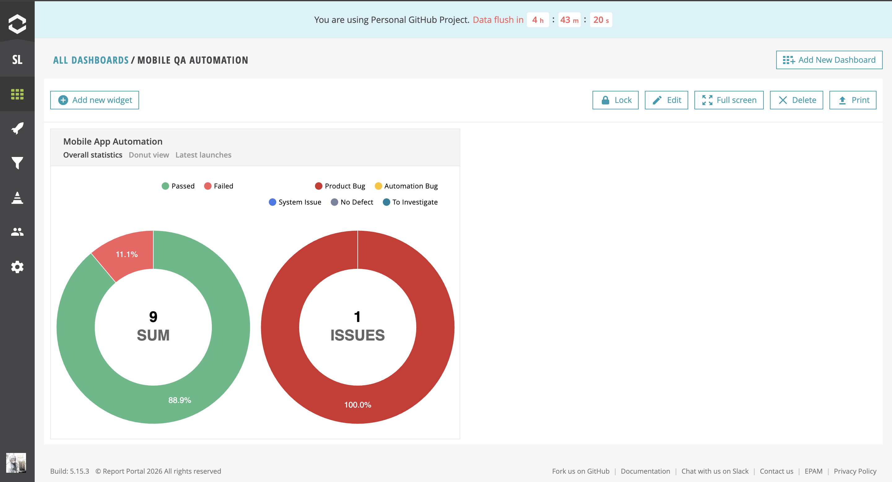
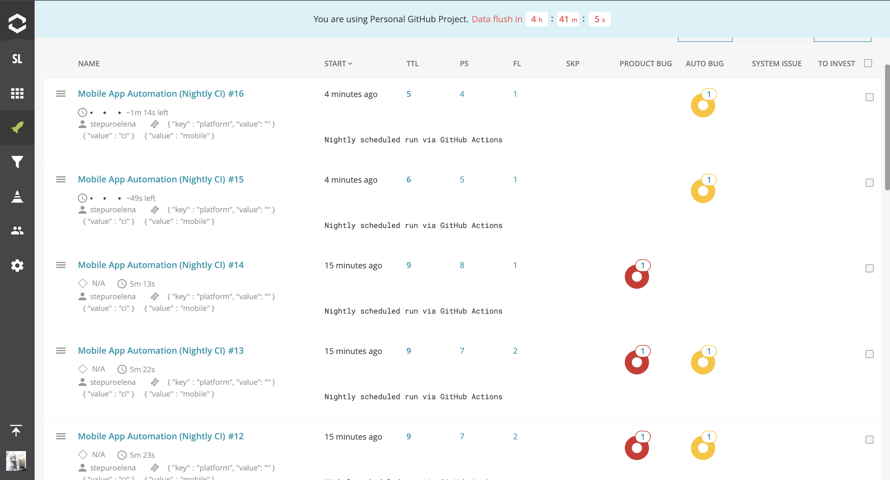
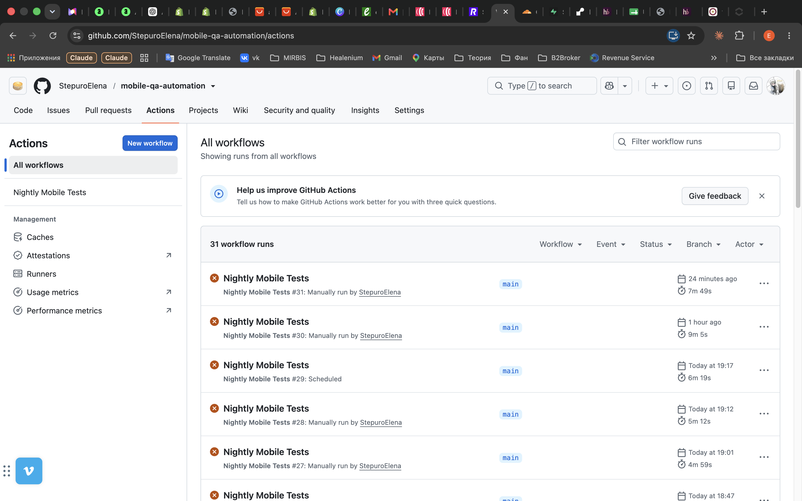

# Mobile QA Automation — Weather App

A test automation framework for the mobile Weather App.

## Table of Contents

- [Tech Stack](#tech-stack)
- [Architecture and Project Structure](#architecture-and-project-structure)
  - [Design Patterns and SOLID](#design-patterns-and-solid)
  - [Configuration](#configuration)
  - [Test User Setup](#test-user-setup)
  - [Test Scenarios](#test-scenarios)
  - [Logging](#logging)
  - [Reporting (ReportPortal)](#reporting-reportportal)
- [Setup and Execution](#setup-and-execution)
- [CI/CD](#cicd)
- [Security](#security)
- [Known Limitations](#known-limitations)

---

## Tech Stack

| Technology | Purpose | Why chosen |
|---|---|---|
| **C# / .NET 7** | Core language and platform for the framework | Required by the assignment |
| **Appium.WebDriver** | Mobile app automation (Android/iOS) | Cross-platform (Android + iOS) automation through a single API, avoiding the need for separate native frameworks per platform |
| **NUnit 3** | Test framework, parallelization, reporting | Built-in parallel test execution support, attribute-based test organization, and mature integration with ReportPortal |
| **Serilog** | Structured logging (file + console) | Structured, extensible logging with easy sink configuration (file, console, and potentially other targets), hidden behind `ITestLogger` for DIP |
| **ReportPortal** | Test result visualization and storage | Free public demo server with full dashboards available out of the box — see [Reporting](#reporting-reportportal) for detailed rationale |
| **GitHub Actions** | CI/CD nightly scheduled test runs | Native GitHub integration, free for public repos, supports scheduled (`cron`) and manual (`workflow_dispatch`) triggers |

---

## Architecture and Project Structure

```
App.Automation/
├── App/        # APK file of the app under test
├── Config/     # Configuration
├── Drivers/    # Appium driver factory
├── Pages/      # Page Object classes
├── Tests/
│   ├── Base/   # Base test class
│   └── *.cs    # Test scenarios
├── Utils/
│   └── Logger/  # Logging + step-logging for reports
└── README.md
```

### Design Patterns and SOLID

#### Abstract Factory (instead of Singleton)

Driver creation is implemented through `IDriverFactory`, with two implementations — `AndroidDriverFactory` and `IosDriverFactory`. The concrete factory is selected in `DriverManager` based on the `Platform` value in the config.

**Why not Singleton:** Using a Singleton for the driver is a common but problematic practice in mobile automation — it doesn't play well with parallel test execution, since a single shared instance would be contended between threads. Instead, the driver is created via a factory and stored in a `ThreadLocal` (see `DriverManager`) — each parallel thread gets its own independent driver instance, and adding a new platform only requires adding a new factory implementation, without touching existing code.

#### Page Object Model

Used to separate UI interaction logic from the test scenarios themselves — tests call page methods instead of working with raw locators directly.

**Structure:** all page classes inherit from a common `BasePage`, which implements the low-level interaction methods (`Tap`, `TypeText`, `GetText`, etc.). Concrete page classes are:

- `LoginPage`
- `RegistrationPage`
- `HomePage`
- `MapPage`
- `SettingsPage` (contains the logout action)
- `WeatherDetailsPage`

**Locators** are kept in separate locator classes per page, rather than inline in the page classes — this keeps the page classes focused on behavior/actions rather than element definitions, and makes it easier to update a locator in one place if the app UI changes.

**Return-type convention:** every action method in `BasePage` returns a result appropriate to what the action does — navigational actions (e.g. `Tap` on an element that leads to another screen) return an instance of the destination page, while non-navigational actions (`GetText`, `TypeText`, etc.) return the relevant value or `void`. This is implemented once in `BasePage` and inherited/reused across all page classes, keeping navigation and interaction patterns consistent throughout the framework.

**Logging:** in addition to the logging already built into `BasePage`'s methods, every page class adds its own logging call around each action — recording which page the action is happening on, which locator is being used, and what action is being performed. This makes it possible to trace exact UI interactions step-by-step in the ReportPortal / Serilog output, beyond just the step-level (`StepLogger`) logging.

#### SOLID in practice

- **SRP** — each page class is responsible only for interactions on its own screen; locators are extracted into separate locator classes rather than mixed into page logic.
- **OCP** — adding a new platform (driver factory) or a new page doesn't require modifying existing classes, only adding new ones.
- **LSP** — `AndroidDriverFactory` and `IosDriverFactory` are interchangeable through the `IDriverFactory` interface; the rest of the framework doesn't care which one is used.
- **DIP** — tests and page classes depend on the `ITestLogger` abstraction for logging, not on Serilog directly, so the logging library can be swapped without touching test code.

### Configuration

All framework parameters (platform, capabilities, timeouts, paths, logging) are kept in a single file, `Config/appsettings.json` — no values are hardcoded in the code. This is intentional: a single source of truth simplifies maintenance and allows changing framework behavior without recompiling — just by editing the JSON.

The configuration supports both platforms simultaneously — `Android` and `iOS` sections exist side by side in `appsettings.json`, and the active platform is switched with a single `Platform` field.

**Note:** iOS settings (device, platform version, bundle ID) are fully defined in the config, and the code is ready to work with the iOS platform. However, **it is not possible to actually run and test an iOS scenario as part of this assignment** — only an APK file built exclusively for Android was provided. It cannot be installed or run on iPhone/iOS. iOS support in the framework is an architectural provision for the future, not a verified working scenario.

In CI (GitHub Actions), the platform is overridden via the `AppSettings__Platform` environment variable, whose value comes from the `TEST_PLATFORM` GitHub Secret — allowing the platform to be controlled centrally without touching the committed `appsettings.json`.

### Test User Setup

Test users are generated **dynamically** for each test run — username, email, and password are auto-generated rather than hardcoded, to avoid collisions between parallel/repeated runs and to keep tests independent of any fixed pre-existing account.

**How it currently works:** since no backend/API for user management was available for this assignment, the dynamically generated user is created by driving the app's own **registration (sign-up) UI** at the start of the test, and the same generated credentials are then reused for the rest of that test's scenario.

**How this ideally should work:** in a real (non-test) environment, user creation/cleanup should not go through the UI at all — it adds unnecessary time and UI-layer flakiness to what is really just test data setup. The correct approach would be to create (and, where relevant, delete) the test user directly via a backend/API call before the test runs — either provisioning one reusable dynamic user, or creating and tearing down a fresh user per test. UI-based registration here is a workaround specifically because no API access was provided as part of this assignment.

### Test Scenarios

A total of **9 test scenarios** were implemented, split across 3 test classes by functional area.

#### LoginTests (2 scenarios)

1. **Negative login** — verifies that a user with incorrect/non-existent credentials cannot log in.
2. **Successful login (smoke/sanity)** — a registered user logs in, and the test checks basic app health: the Home page is displayed, the Map page opens, and the user can log out. This is not a deep functional check of each screen, but a smoke check that the main screens are reachable and render correctly after login.

#### RegistrationTests (4 scenarios)

1. **Successful registration + login** — a user successfully registers (a success toast/message is verified as part of this), then logs in with the same credentials.
2. **Duplicate registration** — verifies that registering twice with the same credentials is not allowed.
3. **Password confirmation match** — on the registration page, the password is entered twice (password + confirm password); the test verifies registration only succeeds when both values match.
4. **Registration button disabled state** — verifies that the Registration button is disabled until all required fields are filled in.
   ⚠️ **This test currently fails — suspected application defect** (the button appears to be clickable before all fields are filled in).

#### MapPageTests (3 scenarios)

1. **Search city → detailed weather page** — a city name is entered in the map's search field, selected from the dropdown, and the test verifies that the detailed weather page opens for that city.
2. **Short weather summary on map tap** — a logged-in user taps on the map and the test verifies that a short weather summary card appears for the tapped location.
   ⚠️ **This test is flaky**: the tap needs to land on land (not on sea/ocean) for the summary to appear, and hit accuracy depends on the coordinates tapped on the given device/emulator. No stable fix has been found yet.
3. **Non-existent city search** — entering a non-existent city name in the search field results in an empty dropdown, since no weather data can be retrieved for it.

### Logging

Implemented via Serilog, hidden behind the `ITestLogger` abstraction — the logging library itself can be swapped out without changing the tests (DIP).

Additionally, **step-logging** is implemented (`StepLogger`) — every meaningful test step is logged as `STEP: ...` / `STEP PASSED: ...` / `STEP FAILED: ...`, making the ReportPortal output readable and structured without needing a separate step-reporting library.

### Reporting (ReportPortal)

**ReportPortal** was chosen for reporting (the public free demo server, demo.reportportal.io).

**Why ReportPortal instead of Allure:** Allure was considered as an alternative and, ideally, would have been the preferred choice — it's a better fit for storing test cases and test scenarios separately from run reports, with richer dashboards for that purpose. However, a free self-hosted deployment of Allure TestOps (with a web dashboard, rather than just a static HTML report) wasn't feasible within the scope of this assignment, while free access to ReportPortal was already available through its public demo server — with full dashboards out of the box.

**Note:** if this framework were integrated into an existing project that already has its own CI/CD pipeline (e.g. Azure DevOps, TeamCity, Jenkins), it would likely make more sense to plug into whatever reporting solution is already used there, rather than introducing a new tool. ReportPortal here was chosen specifically to be able to demonstrate live dashboards for this assignment.

⚠️ **Public demo server limitation:** data on the demo server is periodically flushed (runs and history do not persist long-term), and API tokens issued for it may also be invalidated/reset without notice. This is not meant for long-term storage of results — only for demonstrating/testing the integration.

Because of this, screenshots of representative ReportPortal dashboards are included below for reference, in case the live data is no longer available at review time:




---

## Setup and Execution

### Requirements
- .NET 7 SDK
- Node.js 20+ and Appium (`npm install -g appium && appium driver install uiautomator2`)
- Android SDK + emulator (or a connected real device)

### Install dependencies
```bash
cd App.Automation
dotnet restore
```

### Start the Appium server
```bash
appium
```

### Start the emulator
```bash
emulator -avd <avd_name>
```

### Run tests
```bash
dotnet test --settings Tests/Base/.runsettings
```

---

## CI/CD

Configured via **GitHub Actions** (`.github/workflows/nightly-tests.yml`):

- **Schedule** — runs automatically every day (a manual run via `workflow_dispatch` is also available)
- **Platform** — Ubuntu runner with hardware acceleration for stable Android emulator performance
- Installs: .NET, Node.js, Appium + UiAutomator2 driver
- Results are automatically sent to ReportPortal with `platform`, `mobile`, and `ci` attributes — allowing nightly CI runs to be filtered separately from local runs

▶️ **Run history:** [GitHub Actions runs](https://github.com/StepuroElena/mobile-qa-automation/actions)



---

## Security

- **All sensitive data (ReportPortal API token, test platform) is stored in GitHub Secrets**, not in code or repository configuration files. In the workflow, they're passed via `${{ secrets.* }}` and injected into the configuration at runtime.
- The local `ReportPortal.config.json` file with real values used for development follows a "secret out of code" pattern via `.gitignore` where applicable; a template with placeholders is used for the committed version.
- The application's APK file is included in the repository for the reviewer's convenience when running tests.

---

## Known Limitations

- iOS configuration is architecturally prepared but untested in real conditions — only an Android APK was available.
- ReportPortal (public demo) periodically flushes its history — long-term report storage in production would require a self-hosted instance.
- Test users are created via UI registration rather than via a backend/API, due to no API access being available for this assignment (see [Test User Setup](#test-user-setup)).
- The "Short weather summary on map tap" test is flaky due to map-tap coordinate accuracy (see [Test Scenarios](#test-scenarios)).
- The "Registration button disabled state" test currently fails — suspected application defect (see [Test Scenarios](#test-scenarios)).
